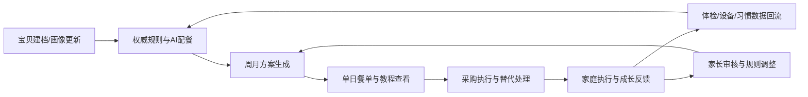

# 七笑果宝贝食光（SevenSmile KidsTime）PRD V1.0

**系统介绍摘要**：七笑果宝贝食光聚焦家庭喂养标准不一、膳食搭配失衡、进食行为难培养等痛点，以权威规则和AI配餐降低养育试错成本，串联多宝贝管理、采购执行、成长跟踪与家庭协作。

**文档版本**：V1.0（当前版本对齐更新）  
**文档状态**：更新完成  
**编制日期**：2026年6月26日  
**修订日期**：2026年6月27日  
**适用平台**：H5 系统 + 微信小程序 `web-view` 承载  
**产品品牌**：七笑果  
**产品名称**：七笑果宝贝食光  
**英文名称**：SevenSmile KidsTime  
**对应原型**：`design/七笑果-宝贝食光-高保真交互原型-V1.0.html`  
**对应方案文档**：`design/七笑果-宝贝食光-产品方案与原型框架-V1.0.md`

---

## 一、文档结论

- 当前 PRD 以现有高保真页面实现为唯一对照基线更新，覆盖已实现页面、状态、交互、角色权限、联动逻辑与合规模块。
- 当前系统版本已形成 `欢迎/建档 -> 首页/方案 -> 单日/采购/素材 -> 跟踪/体检/设备 -> 乐园/许愿/协作 -> 成员/规则/数据源` 的完整闭环。
- 当前系统核心价值不再只是“给出餐单”，而是把 `家庭照护分工 + 多宝贝独立上下文 + AI 生成 + 采购执行 + 成长激励 + 权威出处` 串成可落地、可验证、可扩展的产品链路。
- 本次更新重点补齐旧版 PRD 中缺失或表述不足的能力，包括：多宝贝管理、家长待办、权威数据源管理、饮食习惯语音录入与审批、微信风格底部抽屉、最近使用+推荐入口、隐私协议折叠入口、成长伙伴机制、成员三段式编辑与待确认审核流等，并补充业务流程图、用户故事、优先级、里程碑和验收标准等正式评审所需章节。

---

## 二、产品定义

### 2.1 核心定位

七笑果宝贝食光是一套面向中国家庭场景的儿童营养管理系统，以《中国居民膳食指南（2022）》《中国学龄儿童膳食指南（2022）》《婴幼儿营养喂养评估服务指南（试行）》等权威口径为规则底座，围绕“权威规则 + AI 配餐 + 家庭协作 + 成长激励”构建完整产品闭环，首发以 H5 部署并通过微信小程序 `web-view` 承载。

- 对外统一定位：不是单点菜谱工具，而是把儿童膳食标准转成家庭可执行动作的营养管理系统。
- 对内统一目标：通过多宝贝管理、动态配餐、采购执行、成长跟踪和家庭协作，降低家庭养育试错成本。

### 2.2 用户痛点

基于《中国居民膳食指南（2022）》、中国营养学会儿童膳食指南解读及国家卫生健康委喂养评估文件，当前中国家庭儿童营养管理的核心痛点可归纳为：

- 家庭喂养标准不一：爸妈、祖辈与协作者对“吃什么、吃多少、怎么喂”缺少统一规则，容易导致家庭执行口径不一致。
- 膳食搭配长期失衡：奶类、蔬果、全谷、大豆、早餐、饮水、零食与含糖饮料等日常管理难持续达标，家庭很难把指南要求落实到每日三餐。
- 进食行为难培养：家庭常在追喂、催吃、限制和放任之间摇摆，难以建立规律进餐、自主进食和健康偏好。
- 个体差异难动态处理：年龄、过敏、活动量、体检结果、设备数据和饮食偏好分散在家庭经验里，缺少统一决策中枢。
- 家庭协作效率低：从建档、生成方案、采购、执行到复盘，大量动作依赖人工沟通，易遗漏、难追踪、难复用。

### 2.3 业务价值

- 把权威膳食标准转译为家长、祖辈和宝贝都能理解并执行的日常任务、餐单和采购动作。
- 把单一静态配餐升级为 `多宝贝独立数据管理 + AI 动态重算`，适应真实家庭场景中的差异化照护需求。
- 把方案、采购、教程、体检、设备、习惯与激励机制打通，形成从“生成建议”到“落实执行”的闭环。
- 把家庭成员的角色分工、权限、待办与审核机制显性化，降低沟通成本和执行损耗。
- 用统一的产品话术、页面结构和业务闭环支撑评审、路演、研发设计与后续版本落地。

### 2.4 当前版本范围

当前版本已实现以下能力：

- 多角色视角：爸妈、祖辈、宝贝三类视角独立首页、底部导航与内容分发。
- 多宝贝机制：支持新增宝贝、顶部吸顶标签切换、独立画像/餐单/采购/设备/跟踪数据隔离。
- AI 配餐：支持画像生成方案、语音输入需求、重生成、按场景切换周/月与上学日/周末版/户外日方案。
- 执行闭环：支持单日餐单、采购清单、缺货替代、渠道说明、教程与出处查看。
- 健康联动：支持体检报告模拟识别、设备绑定与同步、健康目标与加餐提醒更新。
- 互动增长：支持积分、抽奖券、盲盒、小游戏入口、许愿池、亲子协作、宠物与花盆成长伙伴。
- 家庭协作：支持成员邀请、待确认审核、角色切换、提醒接收设置、家长规则中心。
- 知识治理：支持权威数据源配置、启停、检测、校验与 AI 专家知识库展示。
- 合规支撑：支持隐私协议折叠展示、权威引用边界、脱敏说明、非诊断提示。

### 2.5 非当前版本范围

- 真实后端账号体系与登录注册。
- 真实 OCR、真实设备 SDK、真实商城下单、真实抽奖概率服务端校验。
- 医疗诊断级建议、医院系统对接、真实处方或临床干预。
- 小程序原生页面实现；当前版本以 H5 形态通过 `web-view` 承载。

---

## 三、目标用户与角色体系

### 3.1 核心用户

| 角色 | 当前系统称谓 | 核心诉求 | 当前系统特征 |
| --- | --- | --- | --- |
| 家长管理员 | 爸妈 | 快速得到可执行方案，并管理规则、审核、设备和成员 | 内容最全、管理动作最多 |
| 祖辈执行者 | 祖辈 | 少看复杂指标，只想知道今天做什么、买什么、注意什么 | 字更大、步骤更少、执行导向 |
| 宝贝体验者 | 宝贝 | 用更有趣的方式参与饮食、任务、愿望和奖励 | 少文字、多反馈、强互动 |

### 3.2 角色访问边界

| 模块 | 爸妈 | 祖辈 | 宝贝 |
| --- | --- | --- | --- |
| 欢迎页与首页 | 完整 | 简化执行版 | 任务互动版 |
| 宝贝建档 | 查看/生成/重生成 | 只读查看 | 不开放 |
| 多宝贝切换 | 支持 | 支持 | 不开放 |
| 方案页与单日详情 | 支持 | 支持 | 可间接查看最近一餐 |
| 采购页 | 支持 | 支持 | 不开放 |
| 素材页 | 完整 | 简化资源组合 | 展示可共学内容 |
| 跟踪页 | 完整健康引导 | 今日提醒版 | 不开放 |
| 体检上传 | 支持 | 不开放 | 不开放 |
| 家长待办 | 支持 | 不开放 | 不开放 |
| 权威数据源 | 支持 | 不开放 | 不开放 |
| 乐园页 | 查看与陪伴 | 查看与陪伴 | 主使用者 |
| 许愿池 | 审核/兑现 | 可在授权后处理审核 | 可提交愿望 |
| 亲子协作 | 完整 | 参与执行 | 主参与者 |
| 家长配置 | 支持 | 不开放 | 不开放 |
| 设备连接 | 支持 | 不开放 | 不开放 |
| 家庭成员 | 支持 | 不开放 | 不开放 |
| 我的页 | 管理版 | 执行版 | 习惯录入版 |

### 3.3 角色分发原则

- 爸妈优先看到 `待审核 + 当前方案 + 设备同步 + 跟踪回填`。
- 祖辈优先看到 `今日餐单 + 采购 + 图文教程 + 做饭提醒`。
- 宝贝优先看到 `任务 + 乐园 + 愿望 + 徽章 + 家务骰子`。
- 所有角色都基于同一套数据底座运行，但前台展现按角色裁剪。

---

## 四、产品目标与成功判断

### 4.1 阶段目标

- 在 2 分钟内让评审看懂系统定位、核心价值与主要闭环。
- 在 5 分钟内完成从建档、配餐、采购、跟踪到激励的完整链路说明。
- 证明系统支持真实家庭场景中的多角色、多宝贝与多数据源协同。
- 证明系统具备从“内容展示”升级到“状态流转与联动闭环”的能力。

### 4.2 业务流程图

业务主链路说明：

- 主链路：建档 -> 配餐 -> 执行 -> 跟踪 -> 调整。
- 数据回流链：体检、设备、习惯和活动量回流后，驱动方案和目标重算。
- 家庭协作链：家长制定规则，祖辈执行餐单，宝贝参与任务与反馈，形成协作闭环。

### 4.3 核心用户故事

| 角色 | 用户故事 | 业务价值 |
| --- | --- | --- |
| 爸妈 | 作为家庭营养管理者，我希望系统按宝贝年龄、活动量、过敏和体检结果自动生成方案，这样我不用每天重复查资料和试菜单。 | 降低决策成本 |
| 爸妈 | 作为家长，我希望能同时管理多个宝贝且数据互不串用，这样不同宝贝可以得到独立的餐单和健康提醒。 | 提升家庭适配性 |
| 祖辈 | 作为执行者，我希望直接看到今天做什么、买什么、注意什么，这样我能少理解复杂指标，直接完成执行。 | 降低执行门槛 |
| 宝贝 | 作为宝贝，我希望通过任务、成长伙伴、愿望和奖励参与饮食管理，这样吃饭和完成任务更有动力。 | 提升参与度 |
| 家长 | 作为管理者，我希望查看待确认的习惯、愿望和成员审核事项，这样全家的规则和权限能被统一管理。 | 保证管理一致性 |
| 家庭成员 | 作为协作者，我希望采购、教程、跟踪和提醒能联动，这样家庭分工后不会遗漏关键动作。 | 提升协作效率 |

### 4.4 优先级规划

| 优先级 | 能力范围 | 当前状态 | 说明 |
| --- | --- | --- | --- |
| P0 | 多宝贝管理、AI 配餐、方案页、单日详情、采购执行、教程资源、家长待办、家庭成员、规则中心、成长激励、数据源管理 | 已实现 | 构成当前评审与路演主闭环 |
| P1 | 真实后端账号体系、真实 OCR 识别、真实设备 SDK 对接、小程序原生化映射、接口与表结构设计 | 待规划/待开发 | 构成产品化落地能力 |
| P2 | 商业下单、外部商城对接、更深度健康服务协同、更多内容平台接入 | 后续规划 | 构成生态扩展能力 |

### 4.5 里程碑规划

| 里程碑 | 目标 | 交付物 | 状态 |
| --- | --- | --- | --- |
| M1 | 明确产品定位与核心功能框架 | 产品方案、PRD 初版、竞品与定位结论 | 已完成 |
| M2 | 完成高保真闭环验证 | H5 高保真页面、角色化首页、业务联动、当前 PRD 对齐稿 | 已完成 |
| M3 | 进入产品化设计阶段 | 数据模型、接口设计、技术方案、测试与验收清单 | 进行中 |
| M4 | 完成小程序承载与验证发布 | H5 部署、`web-view` 承载、联调验证、UAT 版本 | 待启动 |

### 4.6 成功判断标准

- 可完整覆盖至少 18 个页面/视图，且无明显死链。
- 关键状态联动可见：语音 -> AI 方案、采购 -> 准备度、设备/体检 -> 配餐、许愿 -> 审核/兑现、习惯 -> 家长确认、多宝贝 -> 全局切换。
- 权威来源、隐私边界和非医疗提示可被快速说明。
- H5 版本在移动端尺寸下布局稳定，底部导航、抽屉、切换与提示反馈正常。

### 4.7 验收标准

| 验收维度 | 验收标准 |
| --- | --- |
| 定位一致性 | 摘要、产品定位、业务价值、路演口径围绕“家庭营养管理系统”保持一致，不出现冲突说法。 |
| 功能完整性 | 建档、AI 配餐、方案、采购、跟踪、体检、设备、乐园、许愿、协作、成员、规则和数据源等主模块均可访问。 |
| 联动有效性 | 生成方案、切换宝贝、采购状态、设备同步、体检识别、习惯审批、愿望审核等动作能驱动相关页面同步更新。 |
| 角色适配性 | 爸妈、祖辈、宝贝三类角色首页、导航、入口和页面裁剪符合各自职责。 |
| 合规可说明性 | 权威来源、隐私边界、脱敏口径、非诊断说明可在 1 分钟内向评审解释清楚。 |
| 评审可用性 | 文档结构完整，具备业务流程、用户故事、优先级、里程碑和验收标准，可直接用于正式评审。 |

---

## 五、信息架构与全局交互

### 5.1 页面总览

| 编号 | 页面/视图 | 作用 | 当前状态 |
| --- | --- | --- | --- |
| P01 | 欢迎页 | 品牌进入、角色化场景预热、第一印象展示 | 已实现 |
| P02 | 宝贝建档 | 展示画像字段与生成方案入口 | 已实现 |
| P03 | 首页 | 角色化首屏、语音入口、第一动作分发 | 已实现 |
| P04 | 方案页 | 周/月方案与场景筛选 | 已实现 |
| P05 | 单日详情 | 今日三餐、准备度、教程入口 | 已实现 |
| P06 | 采购页 | 今日/本周清单、买菜状态、缺货替代、渠道说明 | 已实现 |
| P07 | 素材页 | 菜谱、播客、图文指导书、视频、课程、书籍 | 已实现 |
| P08 | 跟踪页 | AI 健康引导、今日目标、加餐提醒、祖辈提醒版 | 已实现 |
| P09 | 体检上传 | 脱敏上传与最近识别结果 | 已实现 |
| P10 | 我的 | 角色化个人工作台、常用入口、隐私协议 | 已实现 |
| P11 | 家长待办 | 集中处理待确认事项 | 已实现 |
| P12 | 权威数据源 | 管理 AI 专家知识库 | 已实现 |
| P13 | 乐园页 | 积分、抽奖券、盲盒、成长伙伴、奖励解锁 | 已实现 |
| P14 | 许愿池 | 愿望提交、推荐词、审核状态流转 | 已实现 |
| P15 | 亲子协作 | 协作任务、家庭共学、奖励审核协同 | 已实现 |
| P16 | 家长配置 | 奖励边界、许愿审核、祖辈发奖权限 | 已实现 |
| P17 | 设备连接 | 手表品牌选择、授权项、绑定/同步/解绑 | 已实现 |
| P18 | 家庭成员 | 邀请、待确认、编辑、权限与提醒设置 | 已实现 |

### 5.2 全局导航与壳层交互

- 侧边导航：左侧支持展开/收起，用于快速切换全部页面视图。
- 顶部角色条：支持 `爸妈 / 祖辈 / 宝贝` 三种视角切换，并立即重绘页面内容。
- 底部导航：按角色切换栏目文案与目标页面。
- Toast 提示：所有关键动作均有轻量反馈，如绑定成功、已标记已买、审核通过。
- 微信风格底部抽屉：支持半屏/全屏两段式切换，支持拖拽吸附与关闭。
- 触屏手势：宝贝视角的三餐大图卡支持左右滑动切换。
- 最近使用 + 推荐：常用入口卡片按最近访问和推荐优先级混排，并带状态角标与提示点。

### 5.3 多宝贝全局规则

- 非宝贝视角显示吸顶宝贝标签条。
- 支持新增宝贝档案，录入名字、年龄、身高、体重、活动量、过敏和偏好。
- 切换宝贝后，以下状态同步切换：画像、AI 餐单、采购清单、采购进度、体检摘要、设备状态、成长目标、宝贝偏好、习惯审批状态。
- 成员管理中自动为每个宝贝生成一条 `宝贝本人` 成员记录。
- 宝贝名字修改后，顶部标签、建档页、成员页和相关数据引用同步更新。

### 5.4 合规与说明规则

- 系统所有建议均定位为家庭饮食建议，不替代医疗诊断。
- 体检上传页需明确 `脱敏` 与 `仅提取营养相关指标`。
- 教程与知识内容需提供权威来源或来源口径说明。
- 隐私协议在“我的”页中可折叠展开，集中说明信息使用范围、AI 说明、教程来源与引用边界。

---

## 六、核心模块需求

## 6.1 欢迎页与角色化开屏

### 6.1.1 功能目标

- 在首屏快速说明系统是做什么的。
- 让不同角色进入后看到与自己相关的第一组信息。
- 给宝贝角色制造高参与感的“最近一餐”和任务氛围。

### 6.1.2 已实现内容

- 品牌主视觉与进入产品操作。
- 爸妈视角：课程安排、上下学安排、当前时段重点、学校通知、作业提醒、早餐/晚餐快捷入口。
- 祖辈视角：当前时段推荐、做饭时间表、执行建议。
- 宝贝视角：最近一餐大图卡、左右滑动三餐、收藏、看做法、打卡进度、家务骰子、晚间任务、宠物/花盆成长组件。

### 6.1.3 交互要求

- 宝贝的最近一餐卡支持左右滑动切换早餐/午餐/晚餐。
- 收藏最近一餐后需立即改变收藏状态。
- 点开最近一餐或“看说明”后进入教程抽屉。
- 欢迎页动态卡片需根据当前时段自动切换文案。

## 6.2 宝贝建档与画像生成

### 6.2.1 功能目标

通过最小必要字段展示当前宝贝画像，并支持生成或重生成饮食方案。

### 6.2.2 当前字段展示

| 字段 | 当前表现 |
| --- | --- |
| 年龄 | 文本展示 |
| 身高 | 文本展示 |
| 体重 | 文本展示 |
| 活动量 | 标签展示 |
| 过敏/不耐 | 标签展示 |
| 饮食偏好 | 标签展示 |

### 6.2.3 已实现能力

- 展示当前宝贝画像进度状态。
- 画像同步影响方案生成、采购清单和健康提醒。
- 支持点击 `生成方案/重新生成方案`。
- 生成方案后自动刷新首页、方案页、单日详情页、采购页、跟踪页。

## 6.3 AI 配餐与语音输入

### 6.3.1 功能目标

把宝贝画像、活动量、场景筛选和自然语言诉求转成当日三餐与健康目标。

### 6.3.2 已实现能力

- 首页、首页次入口、方案页均可触发 AI 重新生成。
- 语音抽屉支持拟真逐字浮现、计时、暂停/继续、识别结果显示。
- 爸妈/祖辈的语音输入可写入 `今日饮食需求`，例如“这周运动多，今天想做快手菜”。
- 祖辈确认语音后，可直接打开晚餐教程。
- 宝贝“我的”页支持饮食习惯语音录入，写入待家长确认状态。

### 6.3.3 生成规则

- `上学日 / 周末版 / 户外日` 影响方案标题、理由、热量和行项目。
- `快手` 等语义触发快手菜模式。
- 手表已连接且步数较高时，触发户外补能逻辑。
- 体检上传后，重新计算健康目标与当日方案理由。

### 6.3.4 输出结构

- 早餐、午餐、晚餐文本描述。
- 总热量。
- 当前生成理由。
- 健康目标文案。
- 联动更新采购备注和单日标签。

## 6.4 方案页与单日详情

### 6.4.1 方案页

- 支持 `一周 / 一月` 两种视图切换。
- 支持 `上学日 / 周末版 / 户外日` 三种筛选。
- 方案卡展示标题、生成理由、三餐摘要、总热量和场景信号。
- 行级表格支持整行点击，跳转到早餐、午餐或晚餐详情。
- 祖辈模式下方案页降级为“今天吃什么”的直达列表，减少复杂信息。

### 6.4.2 单日详情

- 展示今日执行准备度。
- 展示早餐、午餐、晚餐三张资源卡。
- 每张卡带标签和 `看详情` 操作。
- 支持根据采购页状态联动显示准备度变化。

### 6.4.3 状态联动

- 采购页勾选已买/缺货替代后，单日详情准备度同步变化。
- 方案筛选变化后，跟踪页加餐提醒与运动目标同步变化。

## 6.5 采购执行模块

### 6.5.1 功能目标

把当前方案转换成可执行的今日/本周采购任务，并支持真实执行状态变化。

### 6.5.2 已实现能力

- 支持 `今日清单 / 本周汇总` 切换。
- 展示食材名称、描述、标签、已买状态、替代状态。
- 支持 `标记已买 / 撤销已买 / 缺货替代`。
- 展示推荐渠道卡片，并通过抽屉说明适合买什么和下单提示。
- 展示最近一次采购动作说明。

### 6.5.3 状态规则

- `已买` 与 `已替代` 均计入准备度。
- 缺货替代时展示同类食材建议文案。
- 采购动作会回写到单日详情和跟踪页中的准备度提示。

## 6.6 教程与学习资源

### 6.6.1 功能目标

让每份餐单不仅能看，还能做、能学、能解释来源。

### 6.6.2 资源分组

| 分组 | 当前内容 |
| --- | --- |
| 今日菜谱图解 | 早餐/午餐/晚餐相关菜谱 |
| 喂养播客 | 家长向音频摘要 |
| 标准化图文指导书 | 步骤化图文教程 |
| 实操短视频 | 2-3 分钟实操视频卡 |
| 儿童营养专业课程 | 家长与祖辈学习内容 |
| 权威书籍推荐 | 书籍与指南入口 |

### 6.6.3 已实现交互

- 任意餐单和资源卡均可打开底部抽屉。
- 餐次类内容支持 `营养搭配说明 / 图文教程 / 视频教程 / 引用边界` 四类入口。
- 主题类内容支持 `营养搭配 / 图文教程 / 视频教程 / 隐私协议` 四类入口。
- 抽屉内可继续跳转外部权威链接。
- 资源卡支持收藏提示。

### 6.6.4 角色差异

- 爸妈优先看到课程、书籍和系统化资源。
- 祖辈优先看到图文指导书、视频和官方口径。
- 宝贝模式仅保留适合共学和一起执行的内容。

## 6.7 跟踪、体检与设备联动

### 6.7.1 跟踪页

- 爸妈/协作者视角：展示最新体检标签、今日执行准备度、今日运动目标、动态加餐提醒。
- 祖辈视角：只展示今日健康提醒、做饭前确认事项。
- 当前版本重点为 `摘要提醒与建议卡`，不展示复杂曲线图。

### 6.7.2 体检上传

- 支持脱敏截图上传。
- 提供 `一键识别` 按钮模拟 OCR 识别。
- 当前识别结果包含：血红蛋白、维生素 D、建议文案。
- 识别成功后自动更新：最近体检标签、健康目标、方案页、单日详情和跟踪页。

### 6.7.3 设备连接

- 支持选择手表品牌：小天才、华为、小米。
- 支持按字段授权：步数、活跃分钟数、能耗估算、同步提醒。
- 支持绑定、重新同步、解除绑定。
- 绑定成功后写入步数、能耗和同步时间，并触发 AI 配餐微调。
- 同步后持续刷新首页、方案页、单日详情和跟踪页。
- 解绑后回退到未连接状态，并恢复基础模板逻辑。

## 6.8 乐园与成长激励

### 6.8.1 功能目标

用孩子愿意参与的方式承接饮食执行后的奖励反馈，形成成长感而非单纯打卡。

### 6.8.2 已实现能力

- 积分、抽奖券、盲盒数值展示。
- 宠物成长与花盆成长两套视觉成长线。
- 成长值决定等级、奖励解锁状态和顶部高亮说明。
- 乐园页展示奖励解锁列表，包括形态、抽奖券、盲盒状态。
- 宝贝欢迎页与首页复用成长组件，保持强记忆点。

### 6.8.3 奖励动作

- 开盲盒：消耗盲盒，增加抽奖券。
- 抽大奖：消耗抽奖券，得到奖励结果抽屉。
- 小游戏：支持“蔬菜连连看”“营养大作战”等闯关入口。
- 宝贝晚间任务：支持通过喂宠物或浇花触发成长反馈。

## 6.9 许愿池与亲子协作

### 6.9.1 许愿池

- 展示推荐愿望词。
- 支持一键加入新愿望。
- 展示状态流转：草稿、待审核、已入池、稍后再议、已兑现。
- 爸妈默认可处理审核；祖辈是否可处理取决于家长配置。
- 已入池愿望可兑现，兑现后增加积分和抽奖券。

### 6.9.2 亲子协作

- 爸妈/祖辈视角展示协作任务、家庭共学资源、待处理审核。
- 宝贝视角展示今晚协作任务、协作奖励、家庭共学入口。
- 页面用于连接 `愿望审核 + 共学 + 任务 + 奖励池`。

## 6.10 家长配置中心

### 6.10.1 已实现配置项

- 许愿必须审核：开启后愿望先进入待审核；关闭后直接入池。
- 祖辈发奖权限：决定祖辈是否可处理奖励相关动作。
- 奖励边界：`仅健康餐 / 健康 + 自定义 / 无限制`。

### 6.10.2 配置联动

- 关闭“许愿必须审核”后，已有待审核愿望立即转为已入池。
- 祖辈发奖权限变化会同步影响首页、家庭成员页、协作页和我的页说明。
- 奖励边界会影响默认新愿望草稿内容与规则说明。

## 6.11 家庭成员管理

### 6.11.1 功能目标

让家庭协作关系、身份权限与提醒接收都能在同一页完成管理。

### 6.11.2 已实现能力

- 成员按 `待确认成员 / 已加入成员` 分组展示。
- 支持邀请祖辈、协作者、临时照护者。
- 邀请后先进入待确认状态，再通过加入。
- 支持快捷切换角色：管理员、协作者、执行者、只读。
- 支持删除非宝贝成员。

### 6.11.3 三段式编辑页

成员编辑抽屉分为三段：

1. 基础信息：称呼、身份关系、保存名字。  
2. 权限：角色切换或宝贝固定说明。  
3. 提醒接收：方案更新、采购提醒、报告联动开关，以及提醒方式切换。  

### 6.11.4 与多宝贝联动

- 每个宝贝自动生成一条成员记录，状态为成长档案。
- 编辑宝贝名字时需同步更新对应成员和宝贝标签。

## 6.12 我的页、家长待办与隐私协议

### 6.12.1 我的页

- 爸妈视角：家庭成员、家长配置、设备连接、跟踪回填入口；展示饮食习惯待确认卡与数据源管理中心。
- 祖辈视角：今日餐单、采购清单、图文教程、健康提醒入口。
- 宝贝视角：乐园、愿望、协作任务、徽章入口；展示饮食习惯语音录入与爸妈确认状态。

### 6.12.2 家长待办

- 用于集中展示待确认动作。
- 当前待办来源包括：饮食习惯确认、愿望审核、成员确认、数据源校验、设备连接。
- 每个待办卡均附带直接处理按钮。

### 6.12.3 隐私协议

- 默认折叠在“我的”页底部。
- 展开后展示信息使用范围、AI 生成说明、教程与视频来源、引用边界。
- 支持跳转官方来源链接。

## 6.13 权威数据源与 AI 专家知识库

### 6.13.1 功能目标

把系统中的权威内容引用从“静态说明”升级为“可配置、可检测、可解释”的知识源管理能力。

### 6.13.2 当前数据源页面能力

- 展示当前已启用的数据源列表。
- 支持新增自定义数据源。
- 支持编辑、删除、启用、停用、状态检测。
- 支持加入内置权威备选数据源。
- 支持执行 `家长权限与 AI 调用校验`。

### 6.13.3 数据源字段

| 字段 | 说明 |
| --- | --- |
| 数据源名称 | 数据源显示名 |
| 来源机构 | 权威机构或平台 |
| 内容类型 | 营养餐方案 / 图文教程 / 视频教程 |
| 数据源链接 | 外部链接 |
| 来源可靠性 | A / A+ 等级 |
| 更新频率 | 周更 / 月更 / 专题更新 |
| 鉴权方式 | 免鉴权 / API Key / OAuth 2.0 |
| 适配状态 | 已适配 / 待补充 |
| 接口适配说明 | 抓取或接口适配方式 |

### 6.13.4 使用规则

- 仅家长可配置数据源。
- 链接异常或待补鉴权时，应以提示状态显示，不可宣称可调用。
- AI 调用概览需展示：已启用数量、营养餐方案覆盖、图文教程覆盖、视频教程覆盖、最近校验结果。

---

## 七、关键状态流转与联动规则

### 7.1 关键联动矩阵

| 触发动作 | 影响页面/模块 | 当前结果 |
| --- | --- | --- |
| 生成方案 | 首页、方案页、单日详情、采购页、跟踪页 | 同步刷新 AI 餐单与目标 |
| 语音生成方案 | 首页、方案页 | 写入当前需求并可继续重生成 |
| 宝贝习惯语音录入 | 我的、画像、协作、许愿 | 进入待家长确认状态 |
| 家长确认习惯 | 我的、画像、协作 | 偏好与画像正式生效 |
| 切换方案筛选 | 方案页、跟踪页 | 同步更新加餐建议与目标 |
| 标记已买/缺货替代 | 采购页、单日详情、跟踪页 | 准备度变化 |
| 绑定/同步设备 | 首页、方案、单日、跟踪、设备 | 步数与能耗写入，方案微调 |
| 体检识别成功 | 上传、跟踪、方案、单日 | 更新最近体检与目标 |
| 审核/稍后/兑现愿望 | 许愿池、协作、我的、乐园 | 状态流转并发奖 |
| 开盲盒/抽奖 | 乐园、我的 | 奖励资产变化 |
| 添加宝贝 | 宝贝标签、建档、成员 | 新建独立上下文 |
| 切换宝贝 | 全局业务页面 | 切换到目标宝贝的独立数据 |
| 邀请/通过成员 | 成员页、我的 | 家庭结构变化 |
| 修改规则配置 | 许愿、成员、协作、首页、我的 | 权限与状态同步更新 |
| 配置/校验数据源 | 我的、数据源页、教程引用说明 | 专家知识库状态变化 |

### 7.2 典型业务闭环

#### 7.2.1 建档到执行闭环

`建档 -> 生成方案 -> 查看单日 -> 去采购 -> 看教程 -> 执行`

#### 7.2.2 数据回流闭环

`设备同步/体检上传/语音补充 -> AI 重算 -> 首页与方案刷新 -> 新目标与加餐提醒生效`

#### 7.2.3 互动激励闭环

`完成任务 -> 成长值提升 -> 解锁盲盒/抽奖券 -> 愿望兑现 -> 再进入下一轮任务`

#### 7.2.4 家庭协作闭环

`宝贝提交习惯/愿望 -> 家长审核 -> 祖辈执行餐单 -> 家长复盘与规则调整`

---

## 八、数据对象与状态定义

### 8.1 核心数据对象

- 宝贝档案 `babies`
- 当前激活宝贝 `activeBabyId`
- 宝贝画像 `profile`
- 偏好与习惯 `prefs / habitSummary / pendingHabitPrefs`
- AI 餐单 `aiMeal`
- 方案视图 `planView / planFilter`
- 采购清单与进度 `shoppingLists / shoppingProgress`
- 体检摘要 `lastUploadReport / lastCheckupLabel`
- 设备状态 `watch / steps / kcal / lastSyncTime / selectedBrand / devicePerms`
- 家庭成员 `members`
- 愿望池 `wishes`
- 奖励资产 `pts / tix / box`
- 成长伙伴 `petGrowth / plantGrowth / petLevel / plantLevel`
- 权威数据源 `dataSources / lastSourceValidation`
- 最近访问 `recentAccess`

### 8.2 关键状态枚举

| 对象 | 状态 |
| --- | --- |
| 愿望 | 待审核 / 已入池 / 稍后再议 / 已兑现 |
| 成员 | 待确认 / 已加入 / 成长档案 |
| 采购项 | 待买 / 已买 / 已替代 |
| 设备 | 未连接 / 已连接 |
| 习惯审批 | 待家长确认 / 已生效 / 已驳回 |
| 数据源 | 可访问 / 待补鉴权 / 链接异常 |
| 抽屉 | 半屏 / 全屏 |

---

## 九、非功能需求

### 9.1 体验需求

- 移动端主视图宽度适配微信常见手机尺寸。
- 长文本卡片必须启用换行，避免布局拉爆。
- 关键交互均要有即时反馈，不允许无响应点击。
- 角色切换、多宝贝切换、页面切换需在视觉上即时完成。

### 9.2 体验拟真要求

- 语音输入需有逐字出现、计时和暂停/继续效果。
- 上传识别需保留短暂处理中状态，避免“一点就成功”的失真体验。
- 设备同步需体现“再次同步”与数值变化，而不是静态展示。
- 奖励、抽奖、成长解锁需带反馈弹层，形成正向情绪峰值。

### 9.3 合规需求

- 所有教程、课程、书籍、营养说明必须保留来源口径。
- 隐私页需明确系统不替代医生诊疗。
- 体检页需强调脱敏和非诊断边界。
- 儿童互动文案需避免博彩化、羞辱式或强否定表达。

### 9.4 部署需求

- 当前产品基线为 H5 页面。
- 对外展示路径采用微信小程序 `web-view` 承载方案。
- PRD 中所有页面与交互描述均以当前 H5 版本实现为准，后续再映射到小程序原生组件。

---

## 十、功能匹配核对清单

### 10.1 页面覆盖核对

| 功能页/视图 | PRD 是否覆盖 | 说明 |
| --- | --- | --- |
| 欢迎页 | 是 | 已写入角色化开屏与宝贝三餐轮播 |
| 宝贝建档 | 是 | 已写入画像展示与生成方案 |
| 首页 | 是 | 已写入三角色首页与 AI 入口 |
| 方案页 | 是 | 已写入周/月、筛选与整行跳转 |
| 单日详情 | 是 | 已写入准备度与餐单卡 |
| 采购页 | 是 | 已写入今日/本周、已买、替代、渠道 |
| 素材页 | 是 | 已写入教程、播客、课程、书籍与出处 |
| 跟踪页 | 是 | 已写入 AI 健康引导与祖辈提醒版 |
| 体检上传页 | 是 | 已写入脱敏识别与联动 |
| 我的页 | 是 | 已写入三角色工作台、隐私协议与常用入口 |
| 家长待办 | 是 | 已写入待确认事项集中处理 |
| 权威数据源页 | 是 | 已写入数据源增删改查与校验 |
| 乐园页 | 是 | 已写入成长伙伴、盲盒、抽奖与解锁 |
| 许愿池 | 是 | 已写入推荐词、状态流转、兑现 |
| 亲子协作页 | 是 | 已写入协作任务、共学、审核协同 |
| 家长配置页 | 是 | 已写入审核、祖辈权限、奖励边界 |
| 设备连接页 | 是 | 已写入品牌、授权、绑定、同步、解绑 |
| 家庭成员页 | 是 | 已写入邀请、待确认、三段式编辑 |

### 10.2 关键能力核对

| 关键能力 | PRD 是否覆盖 | 说明 |
| --- | --- | --- |
| 多角色首页分发 | 是 | 已覆盖爸妈/祖辈/宝贝差异 |
| 多宝贝隔离切换 | 是 | 已覆盖新增、切换、上下文同步 |
| 语音生成方案 | 是 | 已覆盖语音抽屉与 AI 写入 |
| 宝贝习惯语音录入 | 是 | 已覆盖录入、待确认、生效/驳回 |
| 采购执行状态流转 | 是 | 已覆盖已买、替代、准备度联动 |
| 体检识别联动 | 是 | 已覆盖上传识别和页面联动 |
| 设备同步联动 | 是 | 已覆盖绑定、同步、解绑与方案重算 |
| 权威数据源治理 | 是 | 已覆盖配置、检测、启停、校验 |
| 成长伙伴机制 | 是 | 已覆盖宠物/花盆成长与奖励解锁 |
| 许愿审核与兑现 | 是 | 已覆盖待审核、入池、稍后、兑现 |
| 家长配置联动 | 是 | 已覆盖祖辈权限与审核规则 |
| 成员三段式编辑 | 是 | 已覆盖基础信息/权限/提醒接收 |
| 最近使用+推荐入口 | 是 | 已覆盖常用入口混排规则 |
| 隐私协议折叠入口 | 是 | 已覆盖我的页折叠展示 |
| 微信式半屏抽屉 | 是 | 已覆盖两段式抽屉与拖拽吸附 |

### 10.3 匹配结论

- 结论：当前 PRD 已完整覆盖当前系统版本全部已实现主功能、配套交互和关键联动逻辑。
- 风险提示：当前 PRD 已按当前版本实现收敛描述，未把真实后端、真实 OCR、真实设备 SDK 等未落地能力误写为已实现。

---

## 十一、摘要合规核对

- 摘要原文：七笑果宝贝食光聚焦家庭喂养标准不一、膳食搭配失衡、进食行为难培养等痛点，以权威规则和AI配餐降低养育试错成本，串联多宝贝管理、采购执行、成长跟踪与家庭协作。
- 核对结论：摘要已覆盖 `核心定位 + 业务价值 + 主要功能` 三项信息。
- 字数结论：摘要少于 100 个汉字，符合要求。
- 表达结论：语言简洁、无夸张表述、与当前系统功能范围一致。

---

## 十二、后续维护原则

- 后续若新增页面或新增状态流转，先更新本 PRD，再进入技术设计或开发文档。
- 若页面只做视觉微调、不影响业务规则和信息架构，可仅更新交互稿，不必扩写 PRD。
- 若新增真实后端、真实 OCR、真实设备接入，应在本 PRD 中明确标注从“当前版本能力”升级为“产品能力”的边界变化。
